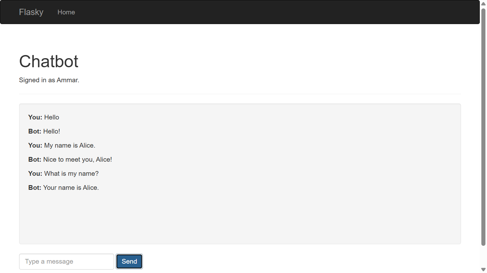
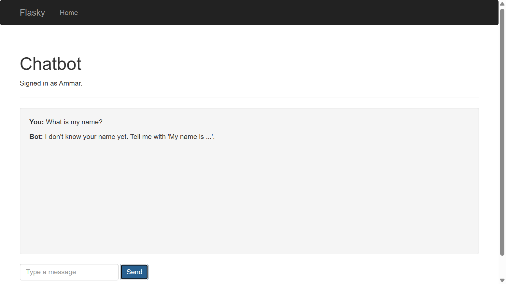

# Ammar Ahmad
This repository is based on https://github.com/miguelgrinberg/flasky

## Activity 1.3 - Chapter 3 Templates


## Activity 1.4 - Chapter 4 Web Forms (non-UofT email)


## Activity 2.4 - Docker

```
docker build -t python-docker .
docker run -d -p 5000:5000 python-docker
docker ps -a
```

The app is then available at http://localhost:5000.

## Activity 2.5 - Chatbot with Memory

After submitting a name and a valid UofT email, the app redirects to `/chatbot`.
Messages are sent to the `/chat` endpoint, which remembers the user's name in
Flask's `session`. The session is stored in a cookie that Flask signs with
`SECRET_KEY`. The browser sends that cookie back with every request, which is how
Flask knows that two requests come from the same user. Logout calls
`session.clear()`, which erases the remembered information.

Chatbot remembering the name:



After logging out and signing in again, the name is forgotten:


